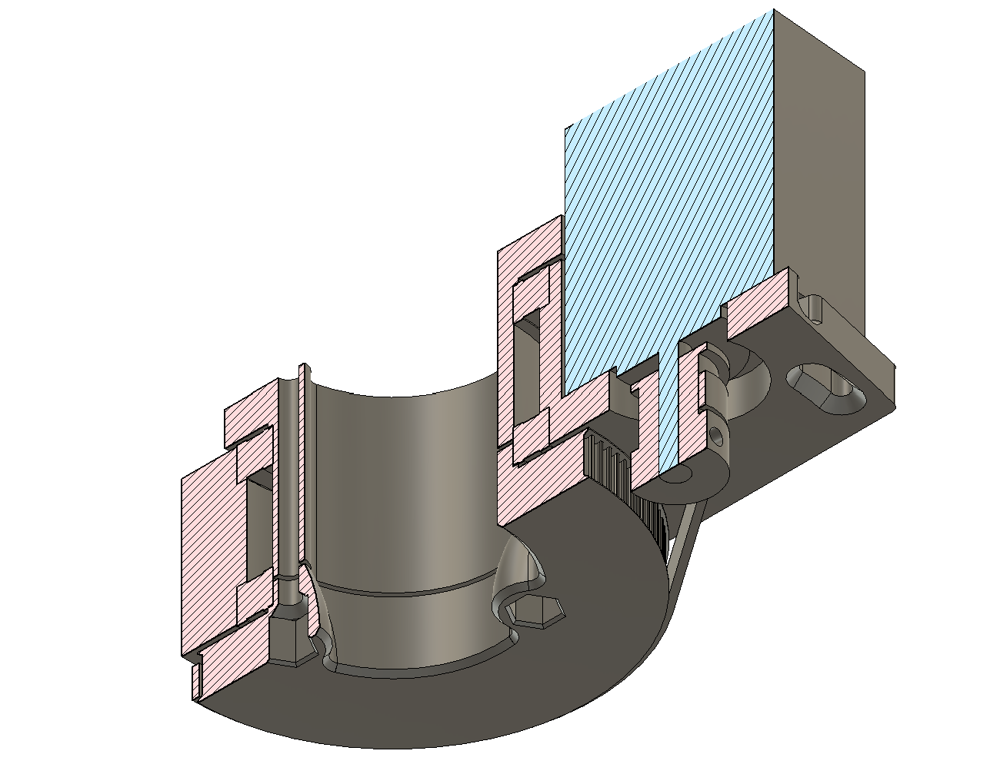

## Rotary Design Pattern

This is a sketch of a little rotary axis design pattern that I use all over the place, I wanted to have a reference for the notion online somewhere - so I've written [this blog post](http://ekswhyzee.com/2019/04/09/gt2-belt-rotary-cad.html) on the topic, and posted example CAD to this repo.

This is also used in the [Clank! modular CNC Machine project](http://clank.tools/). 